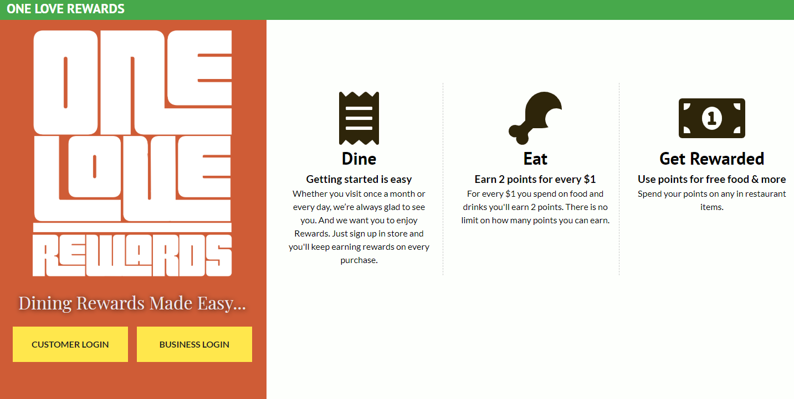
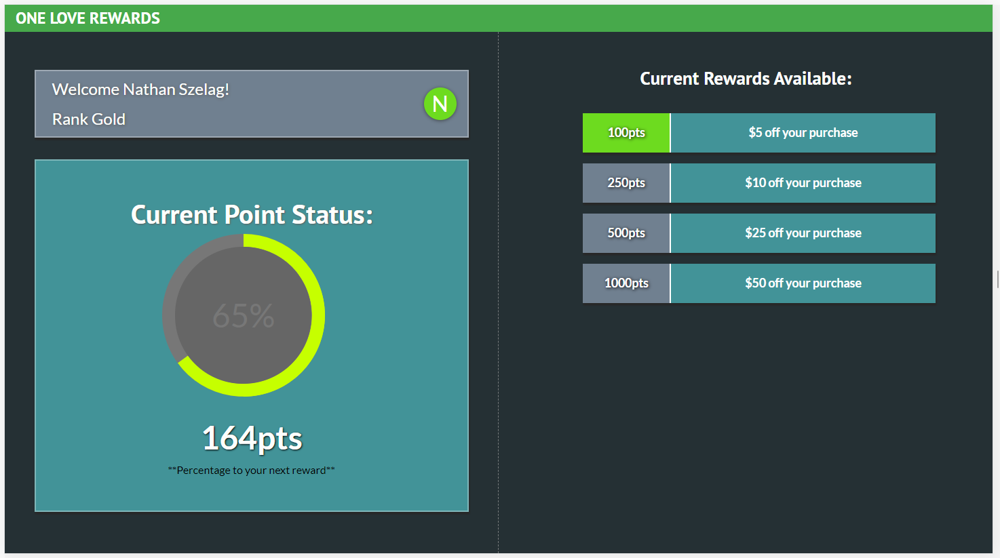

# One Love Rewards

[Live App](https://www.oneloverewards.surge.sh)

One Love Rewards is an open source restaurant rewards platform that allows business owners to implement a free to use program. The app has numerous features which includes a customer dashboard to view points status, a business dashboard which allows you to alter customer accounts, and the ability to add/redeem points for customer purchases.

> To view the server for One Love Rewards [here](https://github.com/Nathan3p0/oneloverewards-server)

## Team

  - __Application Developer__: Nathan Szelag

## Table of Contents

1. [Usage](#Usage)
    1. [Customer](#Customer)
    1. [Business](#Business)
1. [Technologies](#Technologies)
1. [Team](#team)
1. [Contributing](#contributing)

## Usage
### Customer
> - Login by phone number on landing page.
> - Example Phone# to use 734-555-1234.
> - Once logged-in the dashboard page will greet you with your current points status.
### Business
> - Login with demo user name: **admin** and password: **P4ssw0rd**.
> - Once logged-in you will be taken to the dashboard page.
> - Click on the navigation at the top to choose what feature to use.

## Technologies

- React
- HTML
- CSS
- Node
- Express
- PostgreSQL
- Mocha/Chai/Jest
- Heroku
- Surge

## Contributing

See [CONTRIBUTING.md](https://github.com/) for contribution guidelines.